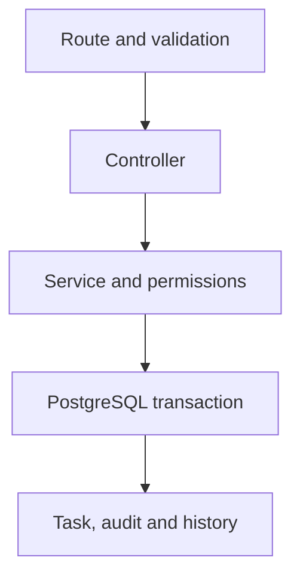

# Orbit Workforce Backend

JavaScript + Express REST API for the supplied Workforce & Task Management PRD. Version 1.1 adds Nodemailer email, OneSignal Web Push, Socket.IO comments and a durable delivery outbox. Includes Prisma/PostgreSQL, JWT access tokens, rotating refresh sessions, backend RBAC and resource scopes, optimistic task concurrency, work logs, notifications, audit history, BullMQ workers, Swagger, tests, and local Docker support.

**No deployment was performed.** Your existing frontend ZIP has not been modified. See the integration guide before connecting it: the backend follows the newer backend PRD and its contract differs from the frontend demo API.

## Email, push and live comments

Follow **`docs/NOTIFICATIONS-AND-REALTIME.md`** for credentials, browser subscription, service worker, socket events and upgrade steps. Defaults in `.env.example` are placeholders; external channels remain disabled until configured. Run BOTH API and worker. The additive migration preserves existing records. Copy the included frontend examples to connect live updates; the earlier frontend has not been rewired.

## Requirements

- Node.js **22 LTS or newer**.
- PostgreSQL: your Supabase database or the included local PostgreSQL service.
- Redis 7 or newer, with `maxmemory-policy noeviction` for BullMQ.
- Docker Desktop is convenient for local infrastructure, including on Windows.

## Local setup (recommended first run)

From the extracted `orbit-workforce-backend` directory:

```bash
npm ci
```

Copy `.env.example` to `.env`:

```powershell
# Windows PowerShell
Copy-Item .env.example .env
```

```bash
# macOS / Linux
cp .env.example .env
```

Generate a signing secret and paste the output into `JWT_ACCESS_SECRET` in `.env`:

```bash
node -e "console.log(require('node:crypto').randomBytes(48).toString('hex'))"
```

Set your desired `SEED_PASSWORD`, then start the local database and Redis:

```bash
docker compose up -d postgres redis
npm run db:generate
npm run db:migrate
npm run db:seed
npm run dev
```

Open a second terminal in the same folder:

```bash
npm run worker:dev
```

- API: **http://localhost:4000/api/v1**
- Swagger: **http://localhost:4000/api/docs**
- OpenAPI JSON: **http://localhost:4000/api/openapi.json**
- Liveness: **http://localhost:4000/health**
- Database/Redis readiness: **http://localhost:4000/ready**

Use the Swagger login endpoint with `X-CSRF-Protection: 1`, copy `data.accessToken`, and enter it in Swagger’s **Authorize** button. Cookie refresh/logout require the same custom header; use a browser client or the included HTTP examples when testing cookies across origins.

### Fictional seed accounts

| Role                | Email                     | Password                    |
| ------------------- | ------------------------- | --------------------------- |
| Admin               | admin@orbit.demo          | Your `.env` `SEED_PASSWORD` |
| Manager             | manager@orbit.demo        | Your `.env` `SEED_PASSWORD` |
| Employee            | employee@orbit.demo       | Your `.env` `SEED_PASSWORD` |
| Other team Manager  | other.manager@orbit.demo  | Your `.env` `SEED_PASSWORD` |
| Other team Employee | other.employee@orbit.demo | Your `.env` `SEED_PASSWORD` |

Seed data includes two teams, projects, and tasks so you can test cross-team access. Running the seed again does not reset passwords or overwrite existing records. Demo seeding is disabled when `NODE_ENV=production`.

## Use Supabase instead of local PostgreSQL

Keep Redis, then set `DATABASE_URL` and `DIRECT_URL` in `.env` to PostgreSQL URLs from your own Supabase project. Add **`schema=workforce`** to both URLs. This package keeps app tables outside the public schema.

- `DATABASE_URL`: runtime connection; use the connection option appropriate to your environment. A session-pooler connection is a straightforward choice for this long-running Express server.
- `DIRECT_URL`: direct database connection, or a session-pooler connection suitable for migrations. Do not run migrations through a transaction-mode pooler.
- Preserve the TLS parameters supplied by your provider. URL-encode special characters in passwords.
- Run `npm run db:generate`, then `npm run db:migrate` against a **new/development database you intend to initialize**.
- Do not put PostgreSQL URLs in `NEXT_PUBLIC_*` variables. No Supabase service-role key is required for the implemented features.

The SQL migration enables RLS without browser-client policies and revokes access from Supabase `anon` and `authenticated` roles when those roles exist. Express uses the trusted server database connection. Do not add the `workforce` schema to Supabase’s exposed Data API schemas. A separately configured runtime database role needs the required grants/RLS strategy; see `docs/SECURITY.md`.

## Useful commands

| Command                                | Purpose                                                     |
| -------------------------------------- | ----------------------------------------------------------- |
| `npm run dev`                          | Watch/restart the Express server                            |
| `npm start`                            | Run the API without the development watcher                 |
| `npm run worker`                       | Run the queue workers and daily scheduler                   |
| `npm run jobs:overdue`                 | Queue one overdue scan immediately                          |
| `npm run db:generate`                  | Generate Prisma Client                                      |
| `npm run db:migrate`                   | Apply committed migrations                                  |
| `npm run db:dev -- --name change_name` | Create a new migration during development                   |
| `npm run db:seed`                      | Add fictional records to a development database             |
| `npm run db:studio`                    | Open Prisma’s local database UI                             |
| `npm run lint`                         | ESLint verification                                         |
| `npm run check`                        | Check all JavaScript syntax                                 |
| `npm run docs:check`                   | Validate/export the OpenAPI document                        |
| `npm run test:unit`                    | Run tests that need no database                             |
| `npm run test:embedded`                | Disposable database/Redis tests without a supplied DB       |
| `npm test`                             | Unit and integration tests against configured test services |
| `npm run format`                       | Format code and documentation                               |

`test:embedded` uses PostgreSQL compiled to WebAssembly (PGlite) and a real disposable Redis process. It is a development-only convenience; it may download/build a Redis binary when none is available. `redis-memory-server` automatic installation is disabled, so normal `npm ci` does not build Redis. A native Redis binary can be supplied with `REDISMS_SYSTEM_BINARY`. The CI workflow runs the integration suite against PostgreSQL 16 and Redis 7 containers.

Integration tests refuse non-localhost database URLs and require a schema name ending in `_test`. They create uniquely named fixture records and do not clean a real database. For a conventional test database, create a disposable `orbit_test` database, set `NODE_ENV=test`, point both URLs at `...?schema=workforce_test`, migrate it, and run `npm test`. Never point tests at Supabase or production.

## Included documents

1. **`docs/TECHNOLOGY-GUIDE.pdf`** - What each technology does, exactly where it is used, and its benefits.
2. **`docs/TECHNOLOGY-GUIDE.md`** - Editable version of the guide.
3. **`docs/API-WALKTHROUGH.md`** - Login, roles, task workflow, concurrency, and queue examples.
4. **`docs/FRONTEND-INTEGRATION.md`** - Differences from your previously generated frontend and the changes to make.
5. **`docs/SECURITY.md`** - Session, authorization, database, logging, and local operating decisions.
6. **`docs/VERIFICATION.md`** - What was tested and what remains environment-dependent.
7. **`docs/ORIGINAL-PRD.md`** - Your supplied requirements.
8. **`examples/frontend-client.ts`** - In-memory access-token client and refresh example.
9. **`examples/requests.http`** - Requests for VS Code REST Client or adaptation to Postman.

## Architecture



Controllers stay thin. Services own workflow, permission scope, and transactions. Repositories hold list queries and shared projections. Smaller features keep short queries in their service or shared pagination helper rather than adding empty pass-through layers.

The three roles are fixed system roles. Admins assign them through the user API; arbitrary role creation and per-user permission toggles are not part of this backend PRD.

## Deliberate implementation choices

- A project belongs to one team; tasks store that team explicitly. This makes Manager resource permissions unambiguous. Team membership is many-to-many, as requested.
- Employees submit work for review. Admins/Managers approve completion, cancel tasks, and reopen closed tasks.
- Every task edit, status change, soft-delete, and work-hour update requires the current `version`; the server increments it atomically.
- User accounts are deactivated, not hard-deleted. Tasks are soft-deleted. Audit rows cannot be edited or deleted through normal APIs, and a database trigger blocks SQL UPDATE/DELETE.
- Task notifications and delivery-outbox rows are written in the same database transaction as the corresponding change. A separate live queue publishes comment/notification signals through Redis to Socket.IO, while external-delivery workers use Nodemailer and OneSignal. Daily overdue notifications remain deduplicated in PostgreSQL.
- Redis is used for the queue and shared rate-limit counters. Dashboard data is intentionally not cached, keeping role-sensitive aggregates current.
- JWT access tokens are returned to the client; opaque refresh tokens live in an HttpOnly cookie and are stored only as SHA-256 hashes. No refresh JWT secret is needed.
- Work-date limits and dashboard “today” use UTC; the daily scheduler uses `JOB_TIMEZONE`, defaulting to Asia/Karachi.
- PostgreSQL row ownership and Supabase network/TLS settings must be configured in your own environment. No external credentials were used here.

Docker and GitHub Actions files are provided for your own use. The local checks do not imply that an image was deployed or that a remote CI run has occurred.
